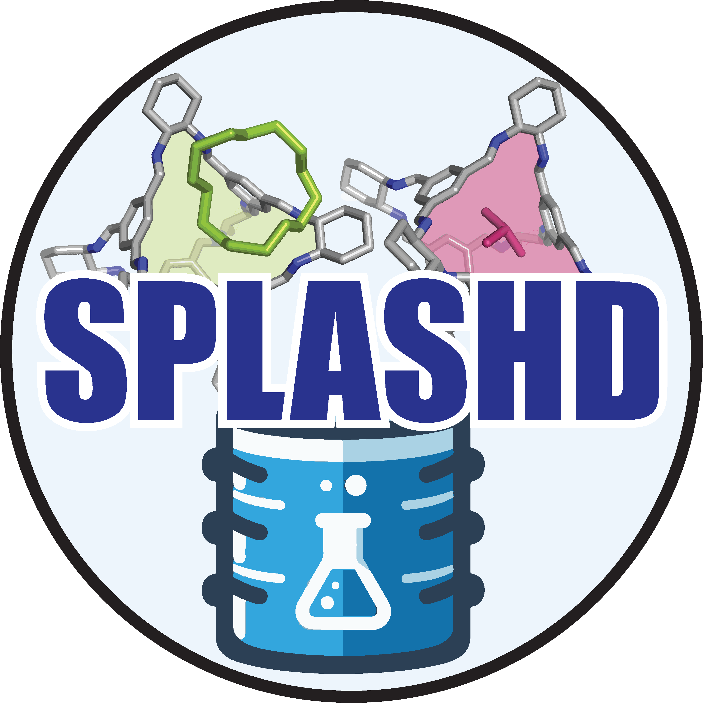
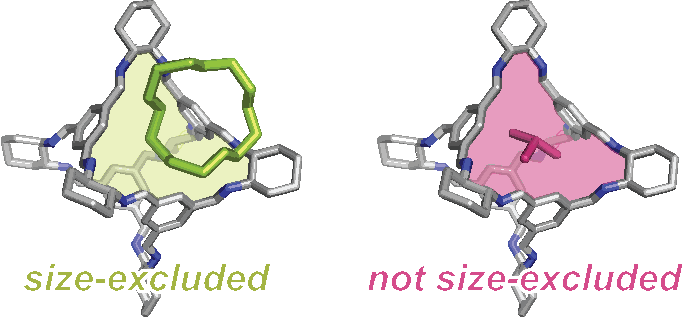
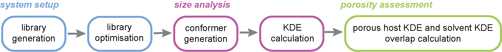

<h1 align="center">
     
    
     
    SPLASHD
     
</h1>

<h4 align="center">Porous liquid size-exclusivity prediction workflow</h4>

    <a href="#key-features">key features</a> •
    <a href="#examples">examples</a> •
    <a href="#running-locally">run locally</a> •
    <a href="#citation">citation</a> •
    <a href="#acknowledgements">acknowledgements</a> •
    <a href="#license">license</a>

 

## key features
<table>
<tr>
<td>

`SPLASHD` is a porous liquid (PL) size-exclusivity prediction workflow to 
accelerate the discovery of PLs.

</td>
<td>

</td>
</tr>

<tr>
<td colspan="2">

`SPLASHD` is comprised of 3 main steps

* **system setup** -- a library of candidate solvents and a library of 
candidate porous motifs are generated and optimized in separate workflows 
* **size analysis** -- conformers of each candidate compound are extracted, 
and their size subsequently analyzed. Porous motif cavity window diameters
are calculated using <a href="https://github.com/marcinmiklitz/pywindow">PyWindow</a>.
Solvent sizes are calculated usng <a href="https://github.com/austin-mroz/SMORES">SMORES</a>.
* **size-exclusivity prediction** -- size exclusivity is predicted from the
size analyses.
</td>
</tr>
</table>
